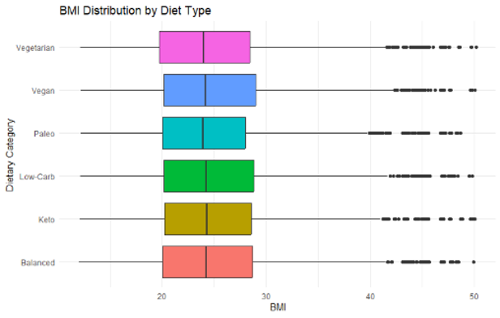
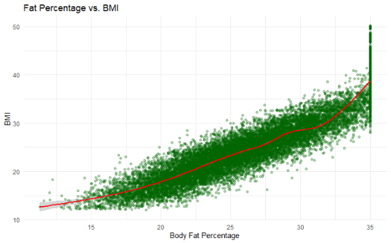
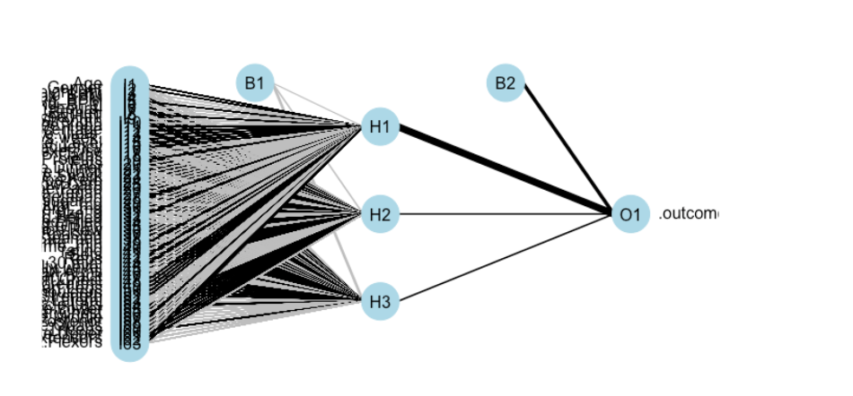
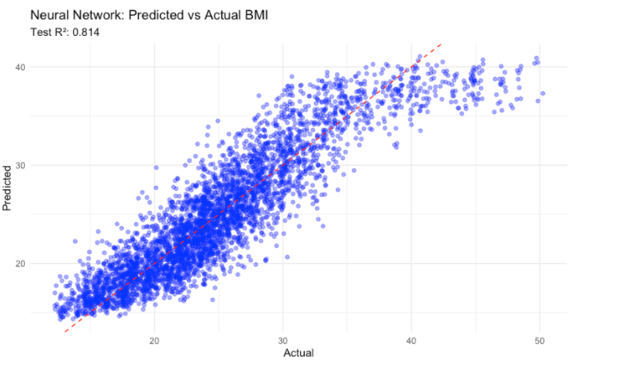

# BMI Prediction with Neural Networks in R

A neural-network regression project for predicting Body Mass Index (BMI) without directly using height or weight.

This repository presents my individual contribution to a four-person **AMS 597 Statistical Computing** team project at Stony Brook University. My work focused on Research Question 3: investigating whether BMI could be predicted from demographic, dietary, exercise, and body-composition features using a Multi-Layer Perceptron neural network.

## Research Question

**Can BMI be predicted without directly using height or weight?**

BMI is calculated from height and weight, so both variables were excluded from the predictor set to avoid direct data leakage. The model instead uses available demographic, lifestyle, dietary, exercise, and body-composition variables.

## Technology

**R · caret · nnet · tidyverse · ggplot2 · Neural Networks · Cross-Validation · Regression · Data Visualization**

## Exploratory Data Analysis

Before fitting the neural network, I explored relationships between BMI and potential predictors.

### BMI Distribution by Diet Type

BMI distributions overlap substantially across dietary categories, suggesting that diet type alone does not strongly distinguish BMI levels. However, it may still contribute useful information when combined with other predictors.



### Fat Percentage vs. BMI

Body-fat percentage shows a strong positive relationship with BMI. The smoothed GAM curve also suggests that the relationship is not perfectly linear across the full range of observations.

This nonlinear pattern motivated the use of a neural network, which can model relationships that may not be captured adequately by a simple linear model.



## Methodology

| Step | Description |
| --- | --- |
| Target | BMI |
| Leakage control | Removed height and weight because BMI is directly derived from them |
| Proxy-variable review | Removed Calories after detecting suspiciously high predictive performance |
| Categorical features | Converted to dummy variables |
| Numerical features | Centered and standardized |
| Model | Multi-Layer Perceptron neural-network regression |
| Implementation | `caret` with the `nnet` method |
| Hyperparameter tuning | Hidden-layer size and weight decay |
| Validation | 5-fold cross-validation |
| Final evaluation | Held-out test set using R², RMSE, and MAE |

## Neural Network Architecture

The final model uses a feed-forward neural network with dummy-encoded predictors as the input layer, a hidden layer, and a continuous BMI output.

Because categorical predictors expand into multiple dummy variables, the input layer contains many nodes and the full architecture becomes visually dense.



## Results

The final neural-network model achieved the following performance on the held-out test set:

| Metric | Result |
| --- | ---: |
| **R²** | **0.814** |
| **RMSE** | **2.93 BMI units** |
| **MAE** | **2.27 BMI units** |

The model explained approximately **81.4% of the variation in BMI**, with predictions typically differing from observed BMI by approximately 2–3 BMI units.

### Predicted vs. Actual BMI

The predicted-versus-actual plot shows a strong relationship between model predictions and observed BMI values across most of the test set.



## My Contribution

My work focused specifically on **Research Question 3** of the team project:

- Conducted exploratory analysis of BMI-related predictors
- Investigated nonlinear relationships between predictors and BMI
- Identified and removed potential leakage and proxy variables
- Prepared categorical and numerical predictors for modeling
- Implemented neural-network regression using `caret` and `nnet`
- Tuned hidden units and weight decay using 5-fold cross-validation
- Evaluated performance using R², RMSE, and MAE
- Created model and result visualizations


## Repository Structure

```text
bmi-neural-network-r/
│
├── README.md
├── .gitignore
├── .gitattributes
│
├── analysis/
│   └── bmi_neural_network.Rmd
│
├── data/
│   └── Final_data.csv
│
└── docs/
    ├── AMS597 Lifestyle Dataset Analysis.pdf
    ├── AMS597 Project Slides.pptx
    │
    └── images/
        ├── bmi_by_diet_type.png
        ├── fat_percentage_vs_bmi.png
        ├── neural_network_architecture.png
        └── predicted_vs_actual_bmi.png
```

## Collaboration

The original AMS 597 project was completed collaboratively by a four-person team.

This repository highlights my individual contribution to Research Question 3, which focused on neural-network modeling for BMI prediction. The full team report and presentation are included in docs/ for project context.

## Dataset

The project uses the Life Style Data dataset published on Kaggle by Jockeroika (2024).

The original dataset contains approximately 20,000 observations covering demographic characteristics, exercise activity, dietary information, and physiological measurements.

## Limitations

The original dataset contained approximately 20,000 observations, but due to limited computational resources, the neural network was trained on a random subset of 2,000 observations.

This reduced training time and made cross-validation more computationally feasible, but it may have limited the model's ability to learn from the full diversity of the dataset. Training on the complete dataset with greater computational resources could potentially improve model stability and predictive performance.

To further reduce computational cost, 5-fold cross-validation was used instead of a more computationally intensive 10-fold procedure.

Neural networks are also less interpretable than traditional regression models, making it more difficult to explain the contribution of individual predictors.

## Future Improvements

Potential extensions include training the neural network on the complete dataset, expanding hyperparameter tuning, comparing the neural network against linear and tree-based regression models, and evaluating performance under alternative feature-selection strategies.

## Disclaimer

This project was completed for academic and educational purposes. The model is intended to demonstrate statistical computing and machine-learning techniques and should not be used for medical diagnosis or health-related decision making.
